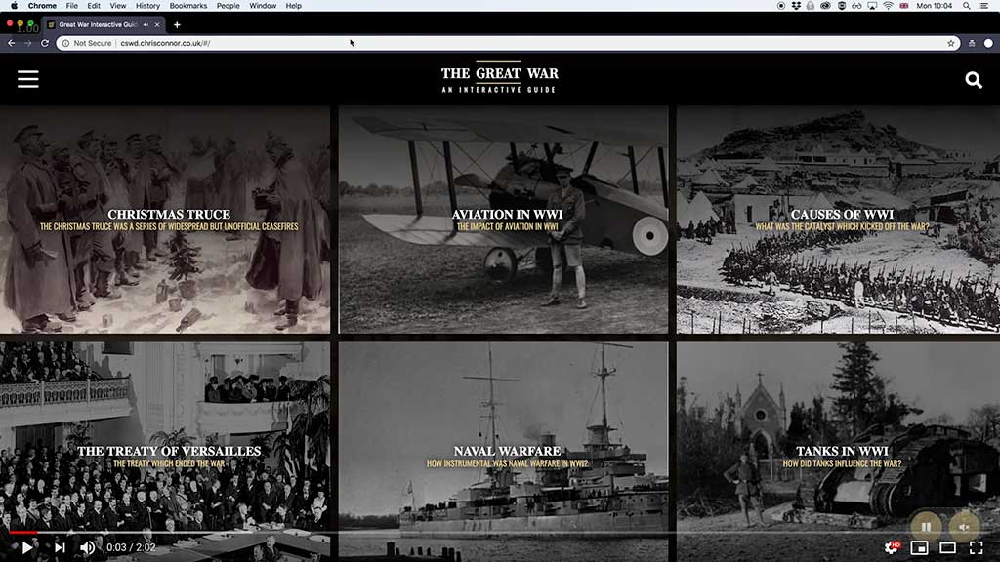

# Interactive Great War Guide

This application was developed as part of a University module on Client Side Web Development. The application was built using html, css and javascript without the use of any frameworks. For build automation and workflow, I used Gulp.

## YouTube Walkthrough

[1]: https://www.youtube.com/watch?v=DpvPUjKfrx8

You can [view a walkthrough][1] of the application on YouTube by clicking the link below.

[][1]


# Setup

To setup and get running on your machine, close this repository and navigate to the root directory.

Run the following commands
```
npm install
gulp buildprod
```

This will create a `dist` directory containing all the neccessary files.

## API

The application also relies on a crude API which can be found in the `API` folder. This relies on PHP and MySQL - the db dump can be found in the `dump.sql` file in the project root.

